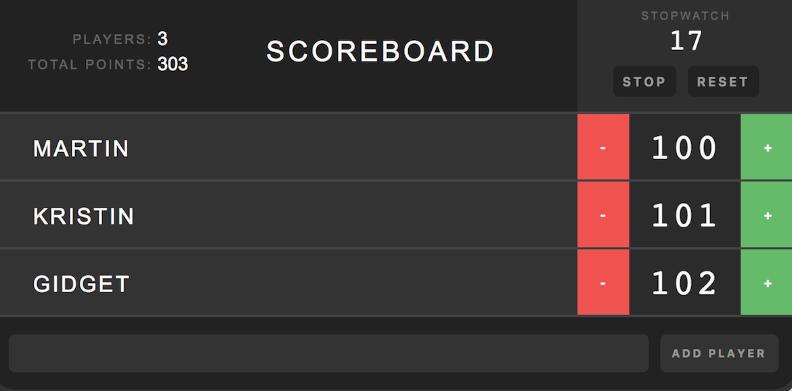

# Treehouse Exercises

### React

Scoreboard allows users to add players, keep score, and track statistics.

# Treehouse Exercises

##### Javascript

- [vanilla](https://github.com/martincartledge/treehouse/tree/vanilla)
- [angular](https://github.com/martincartledge/treehouse/tree/angular)
- [react](https://github.com/martincartledge/treehouse/tree/react)
- [node](https://github.com/martincartledge/treehouse/tree/node)
- [express](https://github.com/martincartledge/treehouse/tree/express)
- [react router](https://github.com/martincartledge/treehouse/tree/react-router)
- [graphql](https://github.com/martincartledge/treehouse/tree/graphql)
- [react hooks](https://github.com/martincartledge/treehouse/tree/react-hooks)
